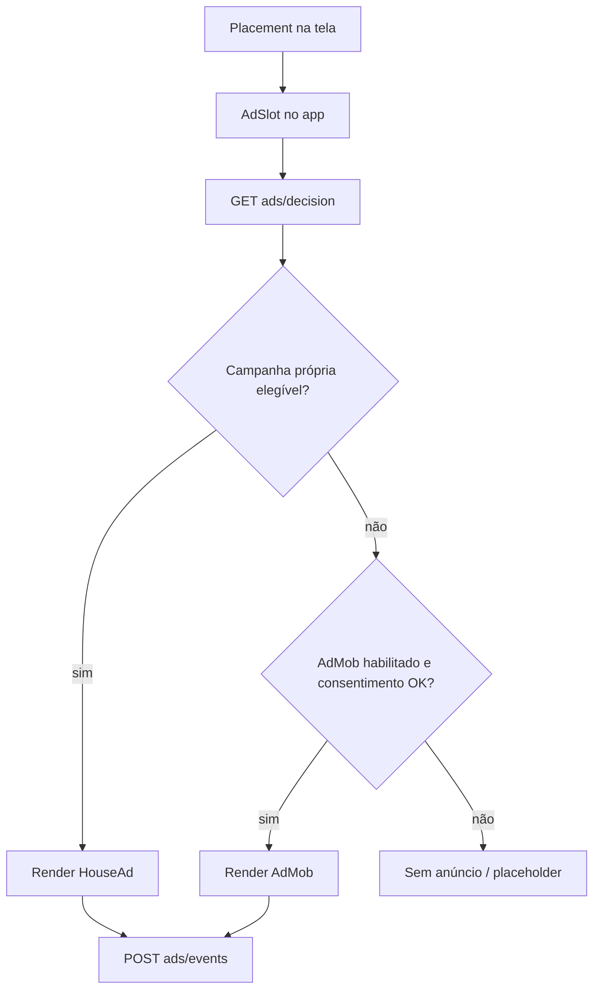

# Anúncios (house ads + AdMob) — resumo para retomar depois

## Objetivo

Exibir anúncios no app no estilo **Google AdMob**, com **inventário próprio** (parceiros promovidos pela plataforma) como base e **AdMob** apenas como complemento quando não houver criativo elegível ou o fill falhar.

## Contexto no projeto (estado atual)

- App **Expo (React Native)** com **tRPC + Prisma** no backend.
- **Não há** integração com AdMob nem camada de anúncios no mobile.
- O modelo `Partner` existente é **cadastro operacional do locador** (seguradora, oficina, peças, etc.), com rotas em `ownerProcedure` e **sem exposição ao motorista** — ver `docs/PARCEIROS.md`.
- Esse `Partner` **não é** inventário de anúncio; misturar os dois sem separar domínios tende a vazar CRM privado e quebrar regras de produto.

## Abordagem recomendada

Tratar como **dois produtos**: inventário próprio (prioridade) e **AdMob só como fallback**.



### 1. Separar “parceiro do locador” de “parceiro promovido”

| Conceito | Uso hoje | Uso em anúncios |
|----------|----------|-----------------|
| `Partner` (CRM do dono) | Vínculo com veículo, gestão interna | Não mostrar ao motorista por padrão |
| `PromotedPartner` / `AdCampaign` | — | Inventário editorial/comercial da plataforma |

No CRM, o parceiro pertence a um `ownerUserId`. Na promoção, a campanha é da **plataforma** (ou de parceiro comercial com contrato), com **imagem, CTA, URL, vigência, prioridade, segmentação** e status ativo.

Opcional: `sourcePartnerId` para reaproveitar nome/categoria, **sem** expor telefone/e-mail do cadastro privado do locador.

### 2. Backend: decisão no servidor

Router dedicado (ex.: `ads`) com:

- **`decision`** — entrada: `placement`, `role`, opcionalmente `uf`/`cidade` (se já existir no perfil), `platform`, `appVersion`; saída: `house` | `admob` | `none` + payload.
- **`track`** — impressão, clique, dismiss, erro de fill (idempotência por `eventId`).

Regras no servidor: vigência, segmentação, frequência, prioridade, exclusividade por placement. O app **renderiza**; não “escolhe” campanha sozinho.

### 3. Mobile: um componente por placement

Pontos naturais no fluxo atual:

- `DriverHomeScreen` — banner abaixo do menu (`HomeMixedMenuGrid`).
- `MarketplaceScreen` — card a cada N veículos na lista.
- Telas de detalhe — banner inferior, com cuidado para não atrapalhar locação.

Padrão sugerido: `AdPlacement` → `AdSlot` → `HouseAdCard` ou `AdMobBanner` (ou rewarded no futuro).

Cache curto da decisão (ex.: 5–15 min) por placement; em erro de rede, fallback para AdMob ou vazio.

### 4. AdMob como complemento

- **Expo:** `react-native-google-mobile-ads` costuma exigir **EAS Build** / prebuild (módulo nativo), não só Expo Go.
- **Web:** política explícita (sem AdMob ou outro formato).
- **Mediation:** casa primeiro; AdMob só se `decision` indicar ou house falhar.
- **Test IDs** em dev; produção via env/EAS secrets.

### 5. LGPD e política de privacidade

A política atual (`PrivacyPolicyContent`) não cobre publicidade nem SDKs de ads. Antes de AdMob em produção:

- finalidade de anúncios e medição;
- possível compartilhamento com Google;
- consentimento quando houver personalização;
- opção de experiência sem ads pagos, se fizer sentido no produto.

Alinhar com o fluxo de `PrivacyAcceptanceScreen` / versão da política.

### 6. MVP em fases

1. **Só house ads** — modelo + API + `AdSlot` em 1–2 telas do motorista + métricas básicas.
2. **Painel/admin** — CRUD de campanhas (pode ser interno no backend no início).
3. **AdMob fallback** — após builds nativos e política atualizada.
4. **Segmentação** — categoria, UF, placement; depois A/B e frequência.

Evitar começar com vários formatos (interstitial, rewarded) e vários placements.

### 7. O que evitar

- Reutilizar `owner.listMyPartners` para o motorista ver “anúncios”.
- Lógica de elegibilidade só no cliente (fraude, inconsistência, difícil de auditar).
- Anúncios em fluxos críticos (login, contrato, pagamento, vistoria) no primeiro corte.
- Prometer receita de AdMob sem medição de fill e sem política de privacidade.

## Resumo

Base sólida: **inventário próprio no backend** + **`AdSlot` no app** + **AdMob como segunda camada**. O `Partner` do locador continua CRM; a promoção ao motorista passa por **campanha/placement** separados, com métricas e LGPD antes de ligar o SDK do Google.

## FAQ (produto e implementação)

Perguntas recorrentes alinhadas à discussão de produto sobre este documento. Use esta seção para retomar o assunto sem depender só do histórico de chat no Cursor.

### CRM vs campanha: são a mesma coisa?

**Não.** São domínios separados:

| | `Partner` (CRM do locador) | `PromotedPartner` / `AdCampaign` (futuro) |
|---|---------------------------|-------------------------------------------|
| **Quem cadastra** | Cada proprietário | Plataforma (admin / contrato comercial) |
| **Quem vê** | Só o locador | Motorista (e eventualmente outros papéis) |
| **Para quê** | Seguradora/oficina do veículo, agenda interna | Banner, CTA, link, promoção |
| **Vínculo** | `ownerUserId` + opcionalmente veículo | Campanha global ou segmentada |

O parceiro que o locador cadastra em **Parceiros** **não vira anúncio automaticamente**. Opcionalmente uma campanha pode referenciar `sourcePartnerId` para reaproveitar **nome/categoria**, **sem** expor telefone, e-mail ou notas privadas do CRM.

### Como os anúncios seriam mantidos e exibidos no app?

**Manutenção (inventário):**

1. A plataforma cadastra **campanhas** no backend (fase 2: painel/admin ou rotas internas).
2. Cada campanha tem criativo (imagem, título, CTA, URL), vigência, placements permitidos, segmentação e prioridade.

**Exibição (runtime):**

1. A tela reserva um espaço fixo (`AdSlot`), ex.: abaixo do `HomeMixedMenuGrid` em `DriverHomeScreen`.
2. O app chama `ads.decision` informando `placement`, `role`, `uf`/`cidade` (do perfil), plataforma e versão.
3. O **servidor** filtra campanhas elegíveis (vigência, região, placement, frequência, prioridade) e responde `house` | `admob` | `none` + payload.
4. O app **só renderiza** (`HouseAdCard`, `AdMobBanner` ou nada) — não escolhe campanha no cliente.
5. Impressão/clique/erro vão para `ads.track` (métricas e auditoria).

```
Motorista abre a tela
       → AdSlot chama ads.decision
       → Backend escolhe campanha (ou admob / none)
       → App exibe o criativo
       → Usuário interage → ads.track
```

### Preciso colocar estado e município no `Partner` do locador para filtrar anúncios?

**Não é o desenho recomendado.** Para anúncios por região:

- **Público (quem vê):** `uf` / `cidade` do **perfil do motorista** (já existem em `DriverProfile`) entram na `decision`.
- **Oferta (o que mostrar):** a **campanha** define alvos (`targetUfs`, `targetCidades`, ou `nationwide`).

Colocar UF/município no `Partner` CRM só faria sentido para organização interna do locador ou para enriquecer `sourcePartnerId` — **não** como núcleo da segmentação de ads. No MVP de segmentação, começar só por **UF** é aceitável; município exige cuidado (cidades homônimas → sempre parear com UF).

### O locador “publica” o parceiro dele para o motorista ver?

**Não, no modelo atual.** Anúncios são **campanhas da plataforma** (possivelmente patrocinadas por um parceiro comercial com contrato). Evitar `owner.listMyPartners` no fluxo do motorista.

### O que cada fase entrega?

| Fase | Entrega | Estado no repo |
|------|---------|----------------|
| **0** | Documentação + `Partner` CRM | Atual |
| **1** | House ads: Prisma, `ads.decision` / `ads.track`, `AdSlot` em 1–2 telas do motorista, métricas básicas | Em `feature/anuncios-fase-1-house-ads` (home do motorista; seed: `npm run ads:seed -w backend`) |
| **2** | CRUD de campanhas (admin interno) | A implementar |
| **3** | AdMob fallback + política de privacidade atualizada + build nativo (EAS) | A implementar |
| **4** | Segmentação (UF, categoria, placement), frequência, depois A/B | A implementar |

Evitar abrir a fase 1 com muitos placements ou formatos (interstitial, rewarded).

### O que dá para implementar no Agent mode (Cursor)?

| Escopo | Agent mode | Exige ação fora do repo |
|--------|------------|-------------------------|
| Modelos Prisma, router `ads`, regras no servidor | Sim | — |
| `AdSlot`, `HouseAdCard`, telas do motorista | Sim | — |
| CRUD admin de campanhas (rotas + telas simples) | Sim | — |
| Segmentação UF/cidade, prioridade, vigência | Sim | — |
| Rascunho de texto na política de privacidade | Sim (não substitui advogado) | Revisão jurídica |
| **AdMob** | Código e config no projeto | Conta Google AdMob, app IDs, **EAS Build**, secrets |
| Campanhas reais (imagem, link, contrato) | — | Negócio / design |
| Deploy produção | — | GitHub, Railway, secrets |

Pedido recomendado ao Agent: *“Implemente a fase 1 do docs/ANUNCIOS.md”* — escopo claro e entregável; fases 2–4 em sessões seguintes.

### O que evitar (reforço)

- Misturar CRM `Partner` com inventário exibido ao motorista.
- Elegibilidade de campanha só no app (sempre no servidor).
- Anúncios em login, contrato, pagamento ou vistoria no primeiro corte.
- Assumir que repo público ou parceiro do locador substitui campanha + `decision`.

## Relacionado

- `docs/PARCEIROS.md` — parceiros operacionais do locador (não confundir com inventário de ads).
