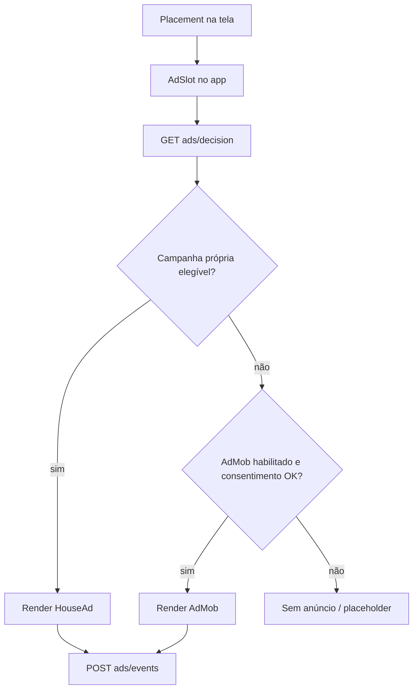

# Anúncios (house ads + AdMob) — resumo para retomar depois

## Objetivo

Exibir anúncios no app no estilo **Google AdMob**, com **inventário próprio** (parceiros promovidos pela plataforma) como base e **AdMob** apenas como complemento quando não houver criativo elegível ou o fill falhar.

## Contexto no projeto (estado atual)

- App **Expo (React Native)** com **tRPC + Prisma** no backend.
- **Não há** integração com AdMob nem camada de anúncios no mobile.
- O modelo `Partner` existente é **cadastro operacional do locador** (seguradora, oficina, peças, etc.), com rotas em `ownerProcedure` e **sem exposição ao motorista** — ver `docs/PARCEIROS.md`.
- Esse `Partner` **não é** inventário de anúncio; misturar os dois sem separar domínios tende a vazar CRM privado e quebrar regras de produto.

## Abordagem recomendada

Tratar como **dois produtos**: inventário próprio (prioridade) e **AdMob só como fallback**.

### 1. Separar “parceiro do locador” de “parceiro promovido”

| Conceito | Uso hoje | Uso em anúncios |
|----------|----------|-----------------|
| `Partner` (CRM do dono) | Vínculo com veículo, gestão interna | Não mostrar ao motorista por padrão |
| `PromotedPartner` / `AdCampaign` | — | Inventário editorial/comercial da plataforma |

No CRM, o parceiro pertence a um `ownerUserId`. Na promoção, a campanha é da **plataforma** (ou de parceiro comercial com contrato), com **imagem, CTA, URL, vigência, prioridade, segmentação** e status ativo.

Opcional: `sourcePartnerId` para reaproveitar nome/categoria, **sem** expor telefone/e-mail do cadastro privado do locador.

### 2. Backend: decisão no servidor

Router dedicado (ex.: `ads`) com:

- **`decision`** — entrada: `placement`, `role`, opcionalmente `uf`/`cidade` (se já existir no perfil), `platform`, `appVersion`; saída: `house` | `admob` | `none` + payload.
- **`track`** — impressão, clique, dismiss, erro de fill (idempotência por `eventId`).

Regras no servidor: vigência, segmentação, frequência, prioridade, exclusividade por placement. O app **renderiza**; não “escolhe” campanha sozinho.

### 3. Mobile: um componente por placement

Pontos naturais no fluxo atual:

- `DriverHomeScreen` — banner abaixo do menu (`HomeMixedMenuGrid`).
- `MarketplaceScreen` — card a cada N veículos na lista.
- Telas de detalhe — banner inferior, com cuidado para não atrapalhar locação.

Padrão sugerido: `AdPlacement` → `AdSlot` → `HouseAdCard` ou `AdMobBanner` (ou rewarded no futuro).

Cache curto da decisão (ex.: 5–15 min) por placement; em erro de rede, fallback para AdMob ou vazio.

### 4. AdMob como complemento

- **Expo:** `react-native-google-mobile-ads` costuma exigir **EAS Build** / prebuild (módulo nativo), não só Expo Go.
- **Web:** política explícita (sem AdMob ou outro formato).
- **Mediation:** casa primeiro; AdMob só se `decision` indicar ou house falhar.
- **Test IDs** em dev; produção via env/EAS secrets.

### 5. LGPD e política de privacidade

A política atual (`PrivacyPolicyContent`) não cobre publicidade nem SDKs de ads. Antes de AdMob em produção:

- finalidade de anúncios e medição;
- possível compartilhamento com Google;
- consentimento quando houver personalização;
- opção de experiência sem ads pagos, se fizer sentido no produto.

Alinhar com o fluxo de `PrivacyAcceptanceScreen` / versão da política.

### 6. MVP em fases

1. **Só house ads** — modelo + API + `AdSlot` em 1–2 telas do motorista + métricas básicas.
2. **Painel/admin** — CRUD de campanhas (pode ser interno no backend no início).
3. **AdMob fallback** — após builds nativos e política atualizada.
4. **Segmentação** — categoria, UF, placement; depois A/B e frequência.

Evitar começar com vários formatos (interstitial, rewarded) e vários placements.

### 7. O que evitar

- Reutilizar `owner.listMyPartners` para o motorista ver “anúncios”.
- Lógica de elegibilidade só no cliente (fraude, inconsistência, difícil de auditar).
- Anúncios em fluxos críticos (login, contrato, pagamento, vistoria) no primeiro corte.
- Prometer receita de AdMob sem medição de fill e sem política de privacidade.

## Resumo

Base sólida: **inventário próprio no backend** + **`AdSlot` no app** + **AdMob como segunda camada**. O `Partner` do locador continua CRM; a promoção ao motorista passa por **campanha/placement** separados, com métricas e LGPD antes de ligar o SDK do Google.

## Relacionado

- `docs/PARCEIROS.md` — parceiros operacionais do locador (não confundir com inventário de ads).
