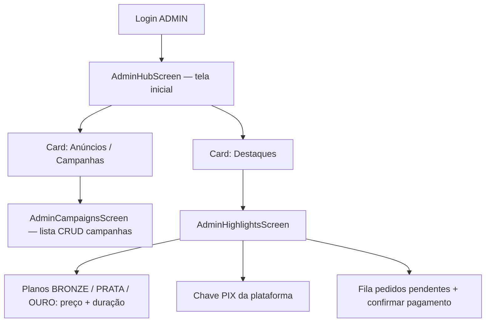
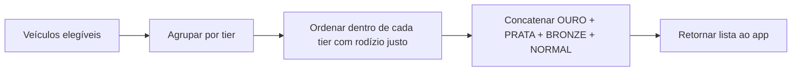
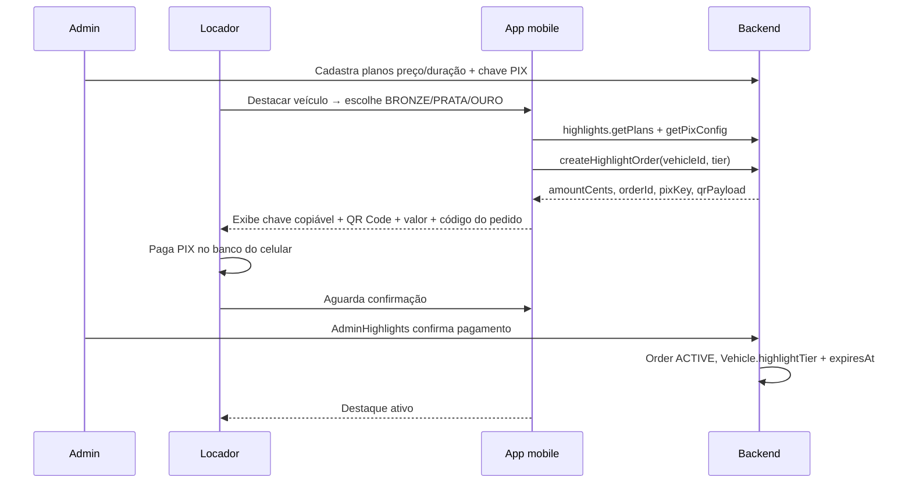

# Destaques no marketplace — classificação, ordenação e monetização

## Objetivo

Permitir que **veículos** apareçam com prioridade na listagem do **Marketplace** (`MarketplaceScreen`), conforme um plano de **destaque** pago (ou concedido pela plataforma):

| Tier | Nome | Posição na lista |
|------|------|------------------|
| `NORMAL` | Padrão (gratuito) | Por último |
| `BRONZE` | Bronze | Terceiro bloco |
| `PRATA` | Prata | Segundo bloco |
| `OURO` | Ouro | Primeiro bloco |

Dentro de **cada tier**, a ordem deve ser **justa**: veículos do mesmo nível alternam posições ao longo do tempo (não ficar sempre o mesmo no topo do bloco).

Monetização inicial: **cobrança por veículo** para tiers pagos (`BRONZE`, `PRATA`, `OURO`), com **PIX** como primeiro meio de pagamento.

---

## Contexto no projeto (estado atual)

- Listagem: `marketplace.listAvailableVehicles` em `backend/src/routers/marketplace.ts`.
- Ordenação hoje: **`updatedAt` descendente** — sem conceito de destaque.
- Modelo `Vehicle` em `backend/prisma/schema.prisma` — sem campo de tier.
- **Admin:** login `ADMIN` abre hoje direto `AdminHomeScreen` (lista de campanhas de anúncios). Não há hub nem módulo de destaques.
- Pagamentos PIX já existem no domínio de **locação** (`RentalPaymentMethod.PIX`, `RentalFinancialEntry`) — padrão reutilizável, **domínio separado** (não misturar pagamento de locação com pagamento de destaque).
- Rodízio justo no produto de **anúncios** (`docs/ANUNCIOS.md`, fase 4 lite): round-robin por impressões no servidor — **referência de implementação** para destaques no mesmo tier.

---

## Princípios de produto

1. **Regra no servidor** — ordenação e rodízio calculados no backend; o app só renderiza a lista retornada.
2. **Destaque por veículo** — cada `Vehicle` tem seu próprio tier e vigência; não é atributo do locador inteiro.
3. **Transparência** — motorista vê badge opcional (Bronze / Prata / Ouro); locador vê tier, validade e como renovar.
4. **Filtros preservados** — destaque só reordena entre veículos **já elegíveis** aos filtros (UF, preço, marca, etc.).
5. **Evitar “leilão oculto”** — documentar critérios; rodízio auditável (métricas de exposição por veículo).

---

## Onde atribuir o destaque (recomendação)

### Melhor lugar: no `Vehicle` + tabela de assinatura/pedido

| Camada | O quê | Por quê |
|--------|--------|---------|
| **`Vehicle`** | `highlightTier` (enum, default `NORMAL`), `highlightExpiresAt` (nullable) | Leitura rápida na listagem; vigência clara |
| **`HighlightPlan`** (nova) | Por tier `BRONZE` / `PRATA` / `OURO`: **preço** e **duração** (dias) definidos pelo admin | Catálogo comercial centralizado; locador vê valores vigentes |
| **`HighlightPlatformConfig`** (nova) | **Chave PIX** da plataforma (e metadados: titular, tipo de chave) | Uma chave para todos os pedidos de destaque no MVP |
| **`VehicleHighlightOrder`** (nova) | Pedido/assinatura: tier, valor copiado do plano, status pagamento, referência do pedido, `startsAt`/`endsAt`, `ownerUserId` | Histórico financeiro, renovação, auditoria |
| **Admin** | Configurar planos (preço/duração), chave PIX, fila de confirmação; conceder tier cortesia | Operação e monetização |
| **Locador** | Fluxo “Contratar destaque” a partir de `OwnerVehiclesScreen` ou tela dedicada | Quem paga é o dono do veículo |

**Não recomendado**

- Tier só no `OwnerProfile` — um locador com 10 carros não pode pagar destaque por um só.
- Ordenação só no mobile (`MarketplaceScreen`) — fraude, inconsistência, difícil de auditar.
- Reutilizar tabela financeira de `Rental` — domínios e obrigações legais diferentes.

### Enum sugerido (Prisma)

```prisma
enum VehicleHighlightTier {
  NORMAL
  BRONZE
  PRATA
  OURO
}

enum VehicleHighlightOrderStatus {
  DRAFT          // carrinho / aguardando PIX
  PENDING_PIX    // PIX gerado, aguardando confirmação
  ACTIVE         // pago e vigente
  EXPIRED        // terminou vigência
  CANCELLED
  REJECTED       // pagamento não confirmado
}
```

Campos mínimos em `Vehicle`:

- `highlightTier` — default `NORMAL`; espelha o pedido **ativo** (ou deriva de `VehicleHighlightOrder` ativa).
- `highlightExpiresAt` — `null` = NORMAL ou sem assinatura ativa.

### Planos por tier (configuração admin)

Cada tier pago tem **dois campos editáveis pelo admin** (não hardcoded no código):

| Tier | Preço (`priceCents`) | Duração (`durationDays`) | Observação |
|------|----------------------|---------------------------|------------|
| `BRONZE` | Definido pelo admin | Definido pelo admin | Ex.: R$ 29,90 / 30 dias |
| `PRATA` | Definido pelo admin | Definido pelo admin | Ex.: R$ 59,90 / 30 dias |
| `OURO` | Definido pelo admin | Definido pelo admin | Ex.: R$ 99,90 / 30 dias |
| `NORMAL` | — | — | Gratuito; sem plano |

- Ao criar pedido, o backend **copia** preço e duração do `HighlightPlan` vigente (snapshot no `VehicleHighlightOrder` para histórico).
- `highlightExpiresAt = paidAt + durationDays` do plano no momento da confirmação.
- Tier com preço `0` ou plano inativo pode ficar indisponível para compra (regra de produto).

### Chave PIX da plataforma

- Uma **chave PIX** global (CPF/CNPJ, e-mail, telefone ou aleatória) cadastrada pelo admin em **Destaques**.
- Usada em **todos** os pagamentos de destaque no MVP (não PIX dinâmico por PSP na fase inicial).
- O locador recebe:
  - **Texto da chave** (copiar/colar no app do banco);
  - **QR Code estático** gerado a partir da chave + valor do pedido + identificador (payload EMV quando possível; senão QR da chave + valor exibidos separadamente).
- Confirmação do pagamento: admin marca pedido como pago na fila (fase 2); webhook PSP fica para fase 5.

---

## Painel admin — hub com dois módulos

Hoje `AdminHomeScreen` é só **campanhas de anúncios**. O desenho alvo:



| Card na hub | Navegação | Conteúdo principal |
|-------------|-----------|-------------------|
| **Anúncios (Campanhas)** | `AdminCampaigns` (evolução do `AdminHome` atual) | CRUD `AdCampaign`, métricas — ver `docs/ANUNCIOS.md` |
| **Destaques** | `AdminHighlights` | Editar **preço** e **duração** de cada tier; cadastrar **chave PIX**; ver/confirmar pedidos de locadores |

**`AdminHighlightsScreen` (escopo documentado)**

1. **Planos** — formulário ou cards para `BRONZE`, `PRATA`, `OURO`:
   - preço (R$ / centavos);
   - duração (dias);
   - opcional: ativo/inativo, descrição curta para o locador.
2. **PIX da plataforma** — campos:
   - chave PIX;
   - tipo da chave (enum);
   - nome do recebedor (exibição);
   - preview de QR (admin valida visualmente).
3. **Pedidos** (fase 2+) — lista `PENDING_PIX`, botão confirmar/rejeitar, link ao veículo e locador.

Rotas sugeridas (`RootStackParamList`): `AdminHub` → `AdminCampaigns` | `AdminHighlights`; formulário de campanha permanece `AdminCampaignForm`.

---

## Ordenação na listagem (marketplace)

### Ordem entre tiers (fixa)

Peso numérico decrescente:

```
OURO (4) → PRATA (3) → BRONZE (2) → NORMAL (1)
```

Fluxo no servidor após `findMany` com filtros:



### Rodízio justo **dentro do mesmo tier**

Objetivo: dois veículos `OURO` não ficarem eternamente na mesma posição relativa.

**Abordagem recomendada (alinhada à fase 4 lite de anúncios):**

1. Contar **exposições na listagem** por `vehicleId` (evento `MARKETPLACE_LIST_IMPRESSION` ou reutilizar padrão `AdEvent`).
2. Dentro do tier, ordenar por **menor contagem** de impressões nas últimas 24h (ou 7 dias).
3. Desempate: `id` estável + offset de sessão (`rotationSeed` opcional na query) para variar entre requisições.

Alternativa **MVP (fase 1–2):** sem métricas — `hash(vehicleId + diaUTC) % N` dentro do tier (simples, menos justo no curto prazo).

| Abordagem | Justiça | Complexidade |
|-----------|---------|--------------|
| Só `updatedAt` dentro do tier | Baixa | Mínima |
| Hash diário por veículo | Média | Baixa |
| Round-robin por impressões | Alta | Média (recomendada para fase 3+) |

**Importante:** rodízio é por **tier + conjunto filtrado** — se o filtro deixa só 3 veículos OURO, o rodízio ocorre só entre esses 3.

### Vigência

- Na query do marketplace: `highlightExpiresAt == null OR highlightExpiresAt > now()` para considerar tier pago; senão tratar como `NORMAL`.
- Job agendado (ou checagem lazy) para rebaixar veículos expirados.

---

## Cobrança por veículo (PIX inicial)

### Modelo comercial — definido pelo admin (não no código)

Preço e duração de **BRONZE**, **PRATA** e **OURO** são cadastrados em **Admin → Destaques**. O locador sempre vê os valores **vigentes** ao solicitar destaque para um veículo.

- Cobrança **por veículo**, não por conta do locador.
- Valor cobrado = `HighlightPlan.priceCents` do tier escolhido no momento do pedido.
- Vigência = `durationDays` do mesmo plano, contada a partir da confirmação do pagamento.
- Renovação manual ou lembrete no app antes de `highlightExpiresAt`.
- Possível desconto por pacote (fase futura).

### Fluxo PIX (MVP — chave + QR configurados pelo admin)



| Fase pagamento | Como funciona | Prós / contras |
|----------------|---------------|----------------|
| **A — PIX estático (MVP)** | Admin configura chave; app gera QR + exibe chave; admin confirma manualmente em **Destaques** | Rápido; depende de operação |
| **B — Comprovante** | Locador anexa print do PIX; admin aprova na mesma fila | Melhor rastreio; ainda manual |
| **C — PSP** (fase 5) | QR dinâmico + webhook | Escala; substitui chave estática |

**Reuso no código:** enum/método `PIX` semelhante a locação; **tabelas** `HighlightPlan`, `HighlightPlatformConfig`, `VehicleHighlightOrder` (`amountCents`, `durationDaysSnapshot`, `orderReference`, `paidAt`, `confirmedByUserId`).

### O que expor ao locador (tela de contratação)

- Cards dos planos **Bronze / Prata / Ouro** com preço e duração lidos do backend.
- Após escolher tier e confirmar pedido:
  - **Valor a pagar** (do plano);
  - **Código/referência do pedido** (para o locador informar ao admin ou colocar na descrição do PIX, se aplicável);
  - **Chave PIX** em texto (botão copiar);
  - **QR Code** para pagamento (leitura no app do banco);
  - Instrução: “Após pagar, aguarde confirmação da plataforma”.
- Tier atual e data de expiração em **Meus veículos**.
- Histórico de pedidos (fase 2).

### O que expor ao motorista

- Badge visual discreto no card (`Bronze`, `Prata`, `Ouro`) — opcional fase 2 UI.
- **Sem** prioridade extra além da ordem na lista (evitar poluição).

---

## Backend (visão técnica)

### Router sugerido: `highlights` ou extensão `owner`

| Procedure | Quem | Função |
|-----------|------|--------|
| `owner.createHighlightOrder` | Locador | Cria pedido, retorna dados PIX |
| `owner.listMyHighlightOrders` | Locador | Histórico por veículo |
| `marketplace.listAvailableVehicles` | Motorista/locador | **Alterar** sort pós-filtro |
| `highlights.admin.getPlans` | Admin | Lê planos BRONZE/PRATA/OURO |
| `highlights.admin.upsertPlan` | Admin | Salva preço + duração por tier |
| `highlights.admin.getPixConfig` | Admin | Lê chave PIX |
| `highlights.admin.upsertPixConfig` | Admin | Salva chave PIX da plataforma |
| `highlights.admin.listOrders` | Admin | Fila de confirmação PIX |
| `highlights.admin.confirmPayment` | Admin | Ativa tier + vigência |
| `highlights.admin.setVehicleTier` | Admin | Cortesia / ajuste |
| `highlights.getPlans` | Locador | Planos ativos (preço, duração) para UI de compra |
| `highlights.getPixConfig` | Locador | Chave PIX + dados para montar QR no pedido |

### Configuração de planos e PIX (admin)

Modelo sugerido `HighlightPlan` (uma linha por tier pago):

- `tier` — `BRONZE` | `PRATA` | `OURO` (unique);
- `priceCents` — inteiro, editável pelo admin;
- `durationDays` — inteiro, editável pelo admin;
- `active` — boolean;
- `description` — opcional, texto para o locador.

Modelo sugerido `HighlightPlatformConfig` (singleton ou `id = 'default'`):

- `pixKey` — string;
- `pixKeyType` — `CPF` | `CNPJ` | `EMAIL` | `PHONE` | `RANDOM`;
- `receiverName` — nome exibido ao locador;
- `updatedAt`.

Alterações de preço/duração **não** alteram pedidos já criados (snapshot no order).

### Métricas (fase 3+)

- `MarketplaceExposureEvent`: `vehicleId`, `viewerUserId?`, `placement: LIST`, `createdAt`.
- Dashboard admin: impressões por tier / conversão pedido → pagamento.

---

## Mobile (visão técnica)

| Tela | Mudança |
|------|---------|
| **`AdminHubScreen`** (nova) | Tela inicial do admin: **dois cards** — “Anúncios (Campanhas)” e “Destaques” |
| **`AdminCampaignsScreen`** | Lista/CRUD de campanhas (conteúdo atual de `AdminHomeScreen`) |
| **`AdminHighlightsScreen`** (nova) | Planos (preço + duração por tier), chave PIX, fila de pedidos |
| `AdminCampaignFormScreen` | Sem mudança de escopo; acesso via campanhas |
| `MarketplaceScreen` | Consumir lista já ordenada; badge de tier no card (fase 3+) |
| `OwnerVehiclesScreen` | Indicador “Destaque Ouro até DD/MM” + CTA contratar |
| **`VehicleHighlightScreen`** (nova) | Escolha do tier; exibe **chave PIX** + **QR Code** + valor; status do pedido |

**Navegação admin (alvo):** `Login ADMIN` → `AdminHub` → card **Anúncios** → `AdminCampaigns` | card **Destaques** → `AdminHighlights`.

**QR Code no locador:** biblioteca RN (ex.: `react-native-qrcode-svg` ou equivalente já usada no projeto) gera imagem a partir do payload retornado pelo backend (chave + valor + `orderReference`).

---

## MVP em fases (implementação)

| Fase | Entrega | Depende de |
|------|---------|------------|
| **0** | Este documento | — |
| **1** | `AdminHubScreen` + dois cards; mover campanhas para `AdminCampaignsScreen`; Prisma tier em `Vehicle`; sort marketplace; `AdminHighlights` placeholder até fase 2 | Migration leve |
| **2** | `HighlightPlan` + `HighlightPlatformConfig`; `AdminHighlightsScreen` (preço, duração, chave PIX); APIs admin upsert/get | Fase 1 |
| **3** | `VehicleHighlightOrder`; fluxo locador com **chave + QR**; `AdminHighlights` confirma PIX; ativa vigência | Fase 2 |
| **4** | Rodízio justo dentro do tier (24h); `MarketplaceExposureEvent`; badges no marketplace (ícones Paper) | Fase 1 |
| **5** | Lembretes de expiração; comprovante opcional; relatórios admin | Fases 3–4 |
| **6** | PSP PIX (webhook), QR dinâmico | Conta PSP, jurídico |

Evitar na fase 1: PSP, pacotes multi-veículo, leilão de posição, destaque sem data de fim.

Pedido recomendado ao Agent: *“Implemente a fase 1 do docs/DESTAQUES.md”* (hub admin + sort); depois fase 2 (planos + PIX admin).

---

## Regras de negócio a validar (checklist)

- [ ] Veículo `available: false` entra na listagem? (hoje não — destaque só se listado)
- [ ] Tier pago sem foto — permitir ou exigir ao menos 1 foto?
- [ ] Um veículo pode ter pedido `PENDING_PIX` e tier ainda `NORMAL` até confirmação?
- [ ] Upgrade PRATA → OURO: proporcional ou preço cheio?
- [ ] Nota fiscal / recibo para o locador (contabilidade)
- [ ] Política de reembolso se veículo desativado antes do fim da vigência
- [ ] Limite de vagas OURO por região (opcional, evitar só OURO no topo)
- [ ] Formato do QR PIX: payload EMV completo vs QR só da chave + valor em texto
- [ ] Identificador do pedido na descrição do PIX (facilita conciliação manual)

---

## O que evitar

- Ordenar só no `FlatList` do `MarketplaceScreen`.
- Campo `destaque` booleano único (sem tiers).
- Pagamento atrelado a `Rental` ou taxa na reserva sem contrato claro.
- Rodízio só no cliente (manipulável).
- Prometer posição #1 fixa — comunicar “prioridade no bloco do tier”.

---

## FAQ

### Por que não usar só `priority` numérico?

Um enum (`OURO` / `PRATA` / …) comunica planos comerciais, preços e UI. Prioridade numérica livre confunde suporte e relatórios.

### Destaque é o mesmo que anúncio (`AdCampaign`)?

**Não.** Anúncio = inventário da **plataforma** (banners). Destaque = **posição na lista de veículos** do locador. Podem coexistir na mesma tela sem misturar modelos.

### NORMAL precisa de rodízio?

Sim, para justiça entre quem não paga: dentro de `NORMAL`, o mesmo mecanismo de rodízio evita que só quem cadastrou por último (`updatedAt`) domine.

### Onde pedir implementação no Agent mode?

- *“Implemente a fase 1 do docs/DESTAQUES.md”* — `AdminHub` + dois cards + sort marketplace.
- *“Implemente a fase 2…”* — planos (preço/duração) + chave PIX no admin.
- *“Implemente a fase 3…”* — pedido locador com chave + QR; confirmação admin.
- *“Implemente a fase 4…”* — rodízio por impressões (reaproveitar `backend/src/ads/`).

### A home do admin deixa de ser só campanhas?

**Sim.** A tela inicial do perfil admin passa a ser **`AdminHubScreen`** com dois cards. O conteúdo atual de `AdminHomeScreen` (lista de campanhas) migra para **`AdminCampaignsScreen`**, acessado pelo card **Anúncios (Campanhas)**.

---

## Relacionado

- `docs/ANUNCIOS.md` — anúncios (house ads); card **Anúncios** no hub admin.
- `docs/PARCEIROS.md` — parceiros CRM do locador (não é destaque de listagem).
- `mobile/src/screens/admin/AdminHomeScreen.tsx` — hoje = campanhas; evoluir para hub + `AdminCampaigns`.
- `backend/src/routers/marketplace.ts` — listagem atual.
- `mobile/src/screens/marketplace/MarketplaceScreen.tsx` — UI da lista.
